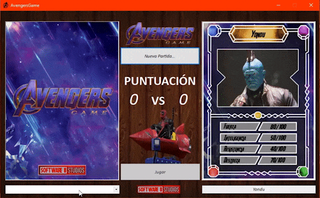

<h1 align="center"> Avengers Game </h1>

  

***

<h2 align="center"> ¿De qué consta este repositorio?</h2>

Es un juego de cartas desarrollado en VB.NET en segundo año de la tecnicatura superior en desarrollo de software del <a href="https://iscarena-cba.infd.edu.ar/sitio/">Instituto Superior Dr. Carlos María Carena</a> como un proyexto diseñado y desarrollado en conjunto con el profesor <a href="https://www.linkedin.com/in/luis-eduardo-tettamanti-72366319/"> Luis Tettamanti</a> (al cual debo mi gran admiración y agradecimiento por su alto nivel de conocimiento, pasión por el desarrollo e impecable calidad enseñanza).
***
<h2 align="center"> ¿De qué trata el juego?</h2>

Es un juego de cartas en dónde se enfrenta un mazo dividido a la mitad con los personajes mas relevantes del Universo Cinematográfico de Marvel.
El objetivo principal es lograr mediante las estadísticas de tus cartas, ganarle a las estadísticas de la carta que muestra la computadora.
  

  

***

<h2 align="center"> Mis Redes </h2>

  

